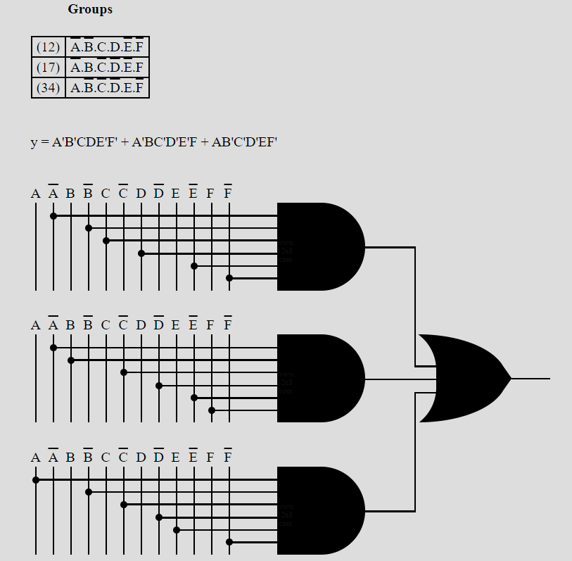

# Rock Paper Scissors
## Structural Modeling
Combining below blocks in one Block
## Behavioral Modeling
https://community.intel.com/t5/Intel-Quartus-Prime-Software/lookup-table-LUT-in-Verilog/td-p/125183
For Case for A Wins
## Data Flow Modeling

For Case B wins